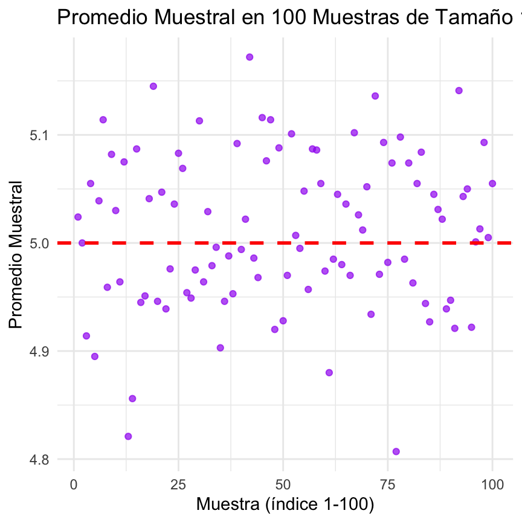
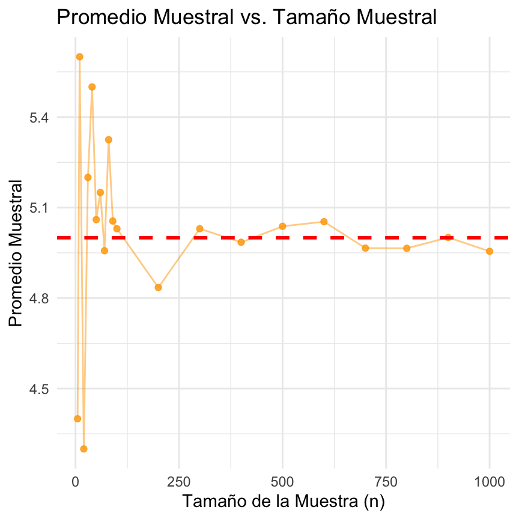

```{r setup, include=FALSE}
knitr::opts_chunk$set(echo = TRUE, message = FALSE, warning = FALSE)
```

## Descripción del Problema 1

Este problema se centra en el análisis de un proceso de solicitudes de servicio técnico que sigue una distribución de Poisson, un modelo probabilístico discreto ideal para contar el número de eventos en un intervalo de tiempo fijo. El objetivo principal es explorar cómo los conceptos de la inferencia estadística, como la estimación de parámetros y la convergencia de los estimaciones, se manifiestan en la práctica a través de la simulación.

La tasa promedio de solicitudes (λ) es de 5 por hora, lo que representa el parámetro poblacional. A través de la simulación, generaremos muestras aleatorias para observar cómo los estimadores muestrales, en este caso la frecuencia relativa y la media muestral, se aproximan a sus respectivos parámetros teóricos (la probabilidad P(X=3) y la media λ=5) a medida que el tamaño de la muestra aumenta. Esto nos permitirá ilustrar los principios de la consistencia y la Ley de los Grandes Números.

## Introducción: Marco Teórico y Justificación
El siguiente informe presenta un análisis sobre el comportamiento de una distribución de Poisson, aplicada a la tasa de solicitudes de reparación de una empresa de servicio técnico. La premisa es que el número de solicitudes por hora sigue una distribución de Poisson con una media teórica (parámetro λ) de 5.

El objetivo de este estudio es doble:

- Estimación de Probabilidad: Estimar la probabilidad de un evento específico (X=3 solicitudes por hora) tanto de forma teórica como a través de simulaciones.

- Estimación de la Media: Analizar cómo la media muestral se aproxima a la media poblacional (λ=5).

Este ejercicio práctico nos permite ilustrar conceptos clave de la inferencia estadística, como la consistencia de un estimador y la Ley de los Grandes Números. Un estimador es consistente si su valor se aproxima al parámetro real de la población a medida que el tamaño de la muestra crece. La Ley de los Grandes Números establece que el promedio de una muestra aleatoria de una variable aleatoria converge a la media teórica de la población a medida que el tamaño de la muestra aumenta.

## Análisis y Resultados

### 1. Cálculo de Probabilidad Teórica
La probabilidad de que lleguen exactamente 3 solicitudes en una hora, bajo una distribución de Poisson con λ=5, se calcula usando la fórmula:

$$
P(X = x) = \frac{\lambda^x e^{-\lambda}}{x}
$$
 
Para $x = 3$ y $\lambda = 5$, la probabilidad es:

$$
P(X = 3) = \frac{5^3 e^{-5}}{3} = \frac{125 \times 0.006738}{6} \approx 0.1404
$$

En R, este cálculo se realiza con dpois(3, lambda = 5), lo que nos da el valor exacto de 0.1403738. Este es el valor de referencia con el que compararemos los resultados de nuestras simulaciones.

### 2. Simulación con una Muestra
Se generó una única muestra de tamaño $n=1,000$ a partir de una distribución de Poisson con $λ=5$. El código rpois(1000, lambda = 5) simula el número de solicitudes en 1,000 horas diferentes.

El cálculo de la frecuencia relativa para $X=3$ en esta muestra se obtuvo como: 
$$\frac{numero\;de\;veces\;que\;aparecio\;3}{1,000} $$

La frecuencia relativa calculada fue de 0.151, muy cercana a la probabilidad teórica de 0.1404 al desviarse en solo 0.0106. Esto demuestra que, incluso con una sola muestra relativamente grande, la frecuencia observada ya comienza a aproximarse a la probabilidad teórica. Adicionalmente, queda en evidencia que El error de muestreo es una característica inherente a la estimación basada en muestras. La diferencia entre el valor del estimador (0.151) y el parámetro poblacional (0.1404) es una manifestación directa de este error aleatorio.

El hecho de que la frecuencia observada sea ligeramente superior a la teórica es perfectamente consistente con la naturaleza aleatoria del proceso de muestreo. Nuestro estimador, la frecuencia relativa, está diseñado para aproximarse al parámetro, pero nunca se garantiza que sea exactamente igual en una única observación muestral.

Podriamos decir que el valor de 0.151 es una estimación fiable, ya que la desviación es mínima en el gran esquema de la distribución de probabilidad, confirmando que la muestra de n=1,000 fue lo suficientemente representativa.

### 3 Análisis de la Variabilidad entre Muestras

Para ilustrar el concepto de la distribución muestral de un estimador, se generaron 100 muestras, cada una de tamaño $n=1,000$, y se calculó la frecuencia relativa para $X=3$ en cada una.

```{r, echo=FALSE, fig.cap="Gráfico de dispersion de Frecuencia Relativa de X=3 en 100 Muestras.", label="frecuencia-variabilidad"}
knitr::include_graphics("graphs/frecuencia_relativa_100muestras.png")
```

El gráfico \@ref(fig:frecuencia-variabilidad) de dispersión con las 100 frecuencias relativas y la línea horizontal en la probabilidad teórica de 0.1404 muestra lo siguiente:

- **Centro y Tendencia:** Los puntos se agrupan alrededor de la línea horizontal. Como puede observarse, la gran mayoría de los puntos (cada uno representando la frecuencia relativa de una muestra) se agrupan de manera clara y visible alrededor de la línea horizontal de referencia. Esta línea representa la probabilidad teórica de $P(X=3)≈0.1404$. La concentración de puntos en este valor nos demuestra, de forma visual, la propiedad de **insesgadez**. Esto significa que, aunque cualquier muestra individual puede tener un valor ligeramente diferente (por ejemplo, el 0.151 del análisis anterior o el punto cerca de 0.17), el promedio de las estimaciones en el largo plazo (las 100 muestras en este caso) converge al valor real.

- **Dispersión y Precisión:** No hay una tendencia de los puntos a desviarse por encima o por debajo de la línea. Y aunque, los puntos no están perfectamente alineados, lo que confirma la presencia del **error de muestreo** inherente. Sin embargo, la dispersión es relativamente baja. La mayoría de los puntos se encuentran en un rango estrecho, lo que indica que, para un tamaño muestral de n=1,000, nuestro estimador es **preciso**. De modo que incluso si solo tomamos una muestra, es muy probable que nuestra estimación esté muy cerca del valor real. La precisión es una medida de la fiabilidad de la estimación.

### 4 Impacto del Tamaño Muestral

En esta sección, se generaron muestras de tamaños crecientes (desde 5 hasta 1,000) para observar el efecto de la muestra en la estimación.


El gráfico de la **Frecuencia Relativa vs. Tamaño Muestral** es una de las demostraciones visuales más poderosas de la **consistencia** de un estimador y de la **Ley de los Grandes Números**.

* **Fase de Alta Variabilidad (Tamaños Muestrales Pequeños):** Lo primero que notamos es la volatilidad de las estimaciones para tamaños de muestra pequeños (n=5, 10, 20). Los puntos se alejan significativamente de la línea teórica de $P(X=3) \approx 0.1404$. Esto subraya un principio crítico en la práctica: las conclusiones basadas en datos limitados pueden ser altamente engañosas y propensas a un **error de muestreo** considerable. Una estimación de 0.20 (para n=5), por ejemplo, no es atípica, pero carece de la fiabilidad necesaria para una toma de decisiones informada.

* **Fase de Convergencia (Tamaños Muestrales Grandes):** A medida que el tamaño de la muestra aumenta (a partir de n=100 en el gráfico), se observa una tendencia inconfundible. La variabilidad de los puntos se reduce drásticamente, y las estimaciones se "pegan" a la línea de la probabilidad teórica. Este comportamiento de **convergencia** es la garantía de que, si tenemos suficientes datos, nuestra estimación muestral se aproximará cada vez más al verdadero parámetro de la población.

Esto demuestra de forma visual el concepto de **consistencia**: a medida que el tamaño de la muestra tiende a ser más grande, la frecuencia relativa (nuestro estimador) converge hacia la probabilidad teórica (el parámetro real). En otras palabras, la diferencia absoluta entre el estimador y el parámetro tiende a cero.

### 5 Convergencia de la Media Muestral

Este análisis es análogo al anterior, pero centrado en la media de la distribución. La media teórica de una distribución de Poisson es igual a su parámetro λ, en este caso, 5.



El gráfico que muestra los **Promedios Muestrales en 100 Muestras** de tamaño $n=1,000$ es una representación visual de la **distribución muestral de la media**.

* **Evidencia de Insesgadez y Precisión:** El patrón de los puntos es notablemente similar al de las frecuencias relativas. Los promedios se distribuyen alrededor de la media teórica ($\lambda = 5$), lo que refuerza que la media muestral es un **estimador insesgado**. La baja dispersión de los puntos (la mayoría entre 4.9 y 5.1) para un tamaño de muestra de $n=1,000$ demuestra la **alta precisión** del estimador. Un bajo **error estándar** de la media muestral nos indica que, si repitiéramos el experimento, los resultados estarían muy cerca del promedio teórico.

* **El Teorema del Límite Central en Acción:** Si bien este gráfico no muestra la distribución de forma explícita, la agrupación simétrica de los puntos alrededor de la media teórica es un resultado directo del **Teorema del Límite Central (TLC)**. El TLC garantiza que, para un tamaño muestral suficientemente grande, la distribución de los promedios muestrales se aproxima a una distribución normal, independientemente de la forma de la distribución original de la población. Esta normalidad nos permite realizar inferencias y construir intervalos de confianza, que son herramientas clave en la estadística.


### 6 Impacto del Tamaño Muestral en la Media

Finalmente, se investigó cómo el tamaño de la muestra afecta la convergencia de la media muestral.



Este gráfico, que muestra la **Convergencia del Promedio Muestral**, es la otra cara de la moneda de la Ley de los Grandes Números.

* **Del Caos a la Estabilidad:** La trayectoria del promedio muestral desde n=5 hasta n=1,000 es elocuente. Para muestras pequeñas, el promedio muestral es errático, con fluctuaciones salvajes. Por ejemplo, se observan valores que varían desde 4.4 a 5.4. Esto subraya que la variabilidad de la muestra inicial puede llevar a estimaciones muy diferentes y potencialmente engañosas.

* **La Estabilización del Estimador:** Sin embargo, a medida que el tamaño muestral aumenta, la línea se estabiliza y se pega a la línea horizontal de $\lambda = 5$. Esto es la esencia de la Ley de los Grandes Números: la "promedio" de las observaciones aleatorias converge a su valor esperado a medida que la muestra crece. Como estadístico, este gráfico es la justificación fundamental para el trabajo con grandes conjuntos de datos (Big Data), ya que nos asegura que, al acumular más información, la estimación del parámetro poblacional se vuelve más robusta, fiable y menos susceptible a las variaciones aleatorias de un pequeño número de observaciones.

Este comportamiento ilustra el funcionamiento de la **Ley de los Grandes Números:** el promedio de las observaciones de una muestra aleatoria de un proceso tiende a la media teórica (el valor esperado de la población) a medida que el tamaño de la muestra se hace más grande. Esto es un pilar fundamental de la inferencia estadística y valida el uso de la media muestral como un estimador confiable del parámetro poblacional.

# Referencias