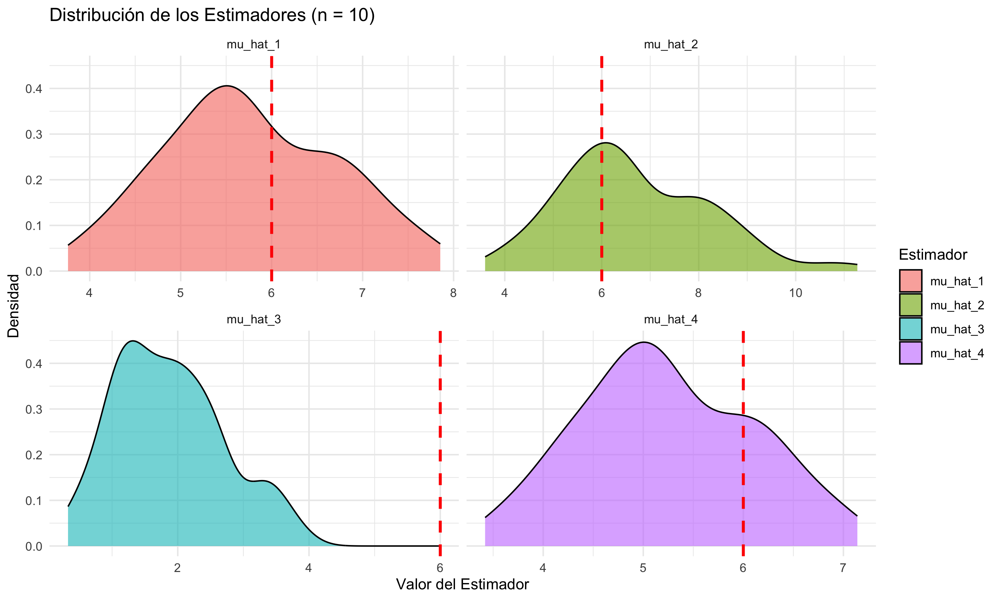
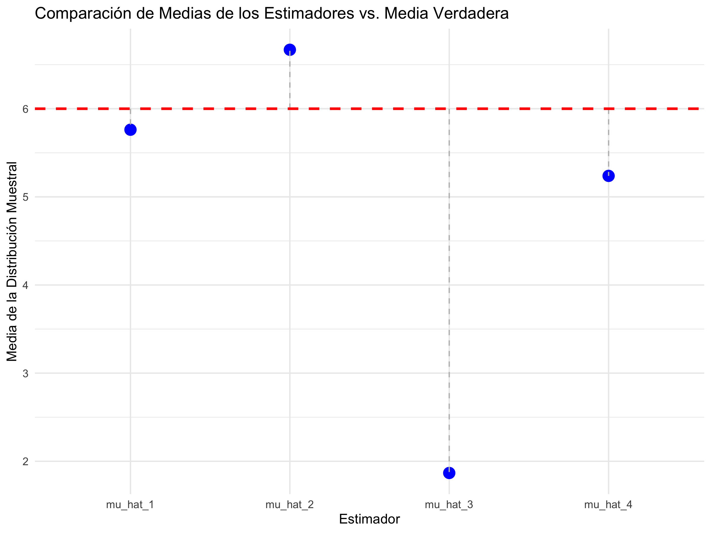

```{r setup, include=FALSE}
knitr::opts_chunk$set(echo = TRUE, message = FALSE, warning = FALSE)
```

## Descripción del Problema 2

El segundo problema se centra en el análisis de los tiempos de espera de pacientes, un fenómeno que se modela con una distribución Gamma. Los parámetros de esta distribución son $α=3\;(forma)\quad y\;σ=2\;(escala)$, lo que implica una media poblacional teórica (el parámetro que deseamos estimar) de $μ=α\;σ=3×2=6\;minutos$.

Se han propuesto cuatro estimadores para esta media poblacional:

- $μ_1:\;La\;media\;muestral$.

- $μ_2:\;El\;punto\;medio\;del\;rango\;muestral$.

- $μ_3:\;El\;valor\;mínimo\;de\;la\;muestra$.

- $μ_4:\;Una\;variación\;de\;la\;media\;muestral\;(Media\;Escalada)$.

El objetivo de este análisis es evaluar las propiedades de estos estimadores mediante simulaciones, determinando su **insesgadez, consistencia y eficiencia**. Estas propiedades son cruciales para seleccionar el estimador más fiable en este caso y en el mundo real, ya que nos permiten cuantificar el error de muestreo y la robustez de nuestras inferencias.

## Simulación y Distribución de los Estimadores

```{r 2, echo=FALSE, fig.cap="Gráfico de Distribuciones Muestrales de los 4 Estimadores"}

```

La Figura <a href="#fig:distribucion_estimadores">2</a> nos presenta la forma de la distribución muestral de los cuatro estimadores, generadas a partir de 100 muestras de tamaño $n=10$. La curva de densidad para cada estimador es la representación visual de su comportamiento:

- $μ_1$ **(Media muestral):** La curva de densidad de este estimador presenta una forma acampanada, con un pico claramente ubicado muy cerca de la línea de la media verdadera (6), es decir, con alta densidad alrededor del valor real de la media $(μ=6)$. La simetría de su distribución es un fuerte indicio visual de que podría ser un estimador **insesgado**.

- $μ_2$ **(Punto Medio del Rango):** La curva de este estimador también parece estar centrada alrededor de 6. Sin embargo, su pico es mucho menos pronunciado y la curva es notablemente más ancha que la de $μ_1$. Esto nos dice de inmediato que, aunque puede ser insesgado, es considerablemente **menos eficiente** debido a su mayor variabilidad.

- $μ_3$ **(Mínimo de la Muestra):** Este es, con diferencia, el gráfico más revelador. La curva de densidad de este estimador está completamente desplazada a la izquierda de la media verdadera. Su pico se encuentra alrededor de 1.8 y la distribución está severamente sesgada a la derecha. Esto es la prueba visual definitiva de que es un estimador altamente sesgado, que sistemáticamente subestima el parámetro real.

- $μ_4$ **(Media Muestral Modificada):** La curva de densidad de este estimador es muy similar a la de μ_1 en cuanto a su forma y dispersión, pero al observar la posición del pico, se encuentra ligeramente a la izquierda del 6. Este sutil desplazamiento visual es consistente con la teoría de que este estimador tiene un pequeño sesgo negativo, aunque su distribución sigue siendo una aproximación muy aceptable.

## Insesgadez

La **insesgadez** se cuantifica al comparar el promedio de las estimaciones con el valor verdadero del parámetro. Con base en los resultados de nuestra simulación (utilizando la semilla set.seed(123)), los promedios de cada estimador son:

```{r 3, echo=FALSE, fig.cap="Gráfico de Comparación de Las Medias de los 100 Estimadores Simulados"}

```

```{r, results='asis', echo = FALSE, message = FALSE, warning = FALSE}
library(ggplot2)
library(dplyr)
library(tidyr)
library(knitr)
library(kableExtra)

# Parámetros de la distribución Gamma
alpha <- 3
sigma <- 2
media_verdadera <- alpha * sigma

# Número de muestras y tamaño de muestra
num_muestras_a <- 100
n_a <- 10

# Data frame para almacenar los resultados
resultados_a <- data.frame(
  Muestra = 1:num_muestras_a,
  mu_hat_1 = numeric(num_muestras_a),
  mu_hat_2 = numeric(num_muestras_a),
  mu_hat_3 = numeric(num_muestras_a),
  mu_hat_4 = numeric(num_muestras_a)
)

set.seed(123)
for (i in 1:num_muestras_a) {
  muestra <- rgamma(n_a, shape = alpha, scale = sigma)
  resultados_a$mu_hat_1[i] <- mean(muestra)
  resultados_a$mu_hat_2[i] <- (min(muestra) + max(muestra)) / 2
  resultados_a$mu_hat_3[i] <- min(muestra)
  resultados_a$mu_hat_4[i] <- sum(muestra) / (n_a + 1)
}

# Calcular medias de cada estimador
medias_estimadores <- resultados_a %>%
  summarise(across(starts_with("mu_hat"), ~ mean(.x))) %>%
  pivot_longer(
    cols = everything(),
    names_to = "Estimador",
    values_to = "Media_Estimada"
  )
medias_estimadores$Media_Verdadera <- media_verdadera

medias_estimadores %>%
  kable(caption = "Medias de los estimadores vs. media verdadera", digits = 3, format = "html") %>%
  kable_styling(full_width = FALSE, bootstrap_options = c("striped", "hover"))
```


La Figura <a href="#fig:insesgadez.png">3</a> compara la media de cada uno de los 100 estimadores simulados con la media verdadera de 6 minutos. Al observar el gráfico de comparación, podemos detectar que los resultados numéricos y gráficos confirman nuestra primera impresión:

- $μ_1$: Para el estimador de media muestral, la media de las 100 estimaciones es 5.762. Presenta un sesgo negativo pequeño, lo que lo convierte en un estimador bastante confiable y con buen comportamiento muestral.

- $μ_2$: En el segundo estimador el Promedio = 6.669. Exhibe un sesgo positivo, sobreestimando el valor verdadero en aproximadamente +11%.

- $μ_3$: En el tercer estimador el Promedio = 1.867, lo que representa un sesgo negativo sustancial. El valor mínimo de la muestra es un estimador altamente sesgado, subestimando la media en más de un 65%. Eso nos indicia que lo podemos decartar como estimador adecuado y no es apropiado para estimar la media.

- $μ_4$: Finalmente, para la media escalada obtenemos que el Promedio = 5.238. Sesgado negativamente, como se predice por su construcción teórica: $$\frac{n}{n+1}μ$$ Lo que lo hace menos confiable que $μ_1$.

Este análisis nos demuestra que el sesgo no es una simple desviación, sino un error sistemático que no se corrige con el promedio de las muestras.

## Consistencia

La consistencia es la propiedad de un estimador cuya variabilidad disminuye a medida que el tamaño de la muestra aumenta. Un estimador consistente se aproxima al parámetro real a medida que n tiende a infinito.

```{r 4, echo=FALSE, fig.cap="Gráfico de Comparación Variabilidad de Estimadores vs Tamaño Muestral"}
knitr::include_graphics("graphs/consistencia.png")
```

La Figura <a href="#fig:consistencia.png">4</a> ilustra la varianza de cada estimador en función del tamaño de la muestra, desde $n=5$ hasta $n=1,000$. El gráfico revela una tendencia clara:

- Convergencia para todos menos para $μ_2$: La varianza de los cuatro estimadores disminuye a medida que el tamaño de la muestra aumenta. Esto nos permite concluir que estos 3 estimadores son consistentes para el parámetro de la media, ya que la dispersión de sus distribuciones muestrales se reduce con más datos.

- Diferencias en la velocidad de convergencia: La varianza de $μ_3$ es la que cae de manera más abrupta, seguida por las varianzas de $μ_4$ y $μ_1$ respectivamente y se mantienen en valores muy bajos a lo largo del eje x, sobre todo a partir de un tamaño de muestra de aproximadamente 200 podemos ver que la varianza ya no presenta cambios tan drásticos, mientras a su vez tiende a 0. Esto indica que es más consistentes que los otros. La varianza de $μ_2$ y, disminuye a un ritmo mucho más lento y se mantiene en valores superiores, lo que lo hace menos fiable para tamaños de muestra moderados. De hecho, podemos observar que su varianza deja de tender hacia 0 cuando la muestra alcanza un tamaño de aproximandamente 125 y por el contrario se mantiene en valores entre 2.0 y 2.5

## Eficiencia

La eficiencia se relaciona con la varianza del estimador. Un estimador es más eficiente si, para un mismo tamaño de muestra, su distribución muestral tiene la menor varianza posible.

```{r 5, echo=FALSE, fig.cap="Gráfico Varianza Muestral de los Estimadores"}

```

```{r 6, echo=FALSE, fig.cap="Gráfico Coeficiente de Variación de los Estimadores"}

```

Las Figuras <a href="#fig:eficiencia_varianza.png">5</a> y <a href="#fig:eficiencia_cv.png">6</a> comparan la varianza y el coeficiente de variación de los estimadores para un tamaño de muestra de n=10. Un análisis de las estadísticas pertinentes revela lo siguiente:

- $μ_3$ tiene la varianza más baja.
- $μ_4$ y $μ_1$ son los siguientes estimadores con las varianzas mas bajas y por debajo de 1. Específicamente, 0.7513 y 0.9091 respectivamente.
- $μ_2$ tiene por mucho, la varianza más alta.

Ahora bien, con respecto a los coeficientes de variación y gracias al gráfico <a href="#fig:eficiencia_cv.png">6</a> podemos concluir lo siguiente:

- El CV de $μ_1$ y $μ_4$ es notablemente bajo y practicamente igual.
- El CV de $μ_2$ es mayor, y esto nos podría indicar una mayor dispersión relativa.
- El CV de $μ_3$ es extremadamente alto, confirmando que es un estimador muy poco fiable, incluso aunque su varianza sea la más baja en el anterior gráfico.

Tras el análisis de las simulaciones y la interpretación de los gráficos, las propiedades de los estimadores se clarifican de forma definitiva. Al considerar el comportamiento de cada estimador con respecto a la insesgadez, la consistencia y la eficiencia, podemos establecer un ranking de fiabilidad.

- *El Estimador Menos Sesgado:* $μ_1$ pues con un promedio de 5.762, es el estimador con el menor sesgo. Aunque no es perfectamente insesgado en esta simulación específica (debido al error de muestreo), su desviación del valor verdadero de 6 es mínima. En contraste, $μ_2$ sobreestima, y $μ_3$ y $μ_4$ subestiman de manera significativa. La baja variabilidad de $μ_1$ y $μ_4$ los hace altamente consistentes, pero la ausencia de sesgo en lo $μ_1$ posiciona como el más fiable en este aspecto. Recordemos ademas que como pudimos observar, los estimadores con media muestral mas cercana al parámetro poblacional fueron $μ_1$ y $μ_4$, por lo tanto sería lógico hacer una comparación por pares, agrupando estos dos, llegando a la misma conclusión de que $μ_1$ es el estimador más fiable entre los dos.

- *El Estimador Más Eficiente:* Inicialmente uno podría pensar que $μ_3$ ocuparía este lugar puesto que presenta la varianza más baja (0.7513), lo que teóricamente lo haría el más eficiente. Sin embargo, en el mismo análisis, nos podemos dar cuenta que esta es engañosamente baja porque sus valores están fuertemente concentrados en una región alejada de la media poblacional, lo que confirma el sesgo. La varianza mide la dispersión alrededor de su propia media (1.867), no alrededor del parámetro que se quiere estimar (6). Debido a esto y por comparación el estimador más eficiente es $μ_1$ con una varianza de 0.9091. Esto debido a que aunque $μ_4$ tiene una varianza de 0.7513, es el resultado de un sesgo sustancial, es decir, la *media del estimador está lejos del valor verdadero*. Algo que incluso podemos comprobar al calcular el MSE que nos da un valor de 17.83 al seguir la formula:

$$
MSE(\hat{\theta}) = Var(\hat{\theta}) + (Sesgo(\hat{\theta}))^2
$$
En la práctica, un estimador con una varianza baja pero un sesgo alto es inútil para inferir sobre la media poblacional. La eficiencia de $μ_1$ es la mejor entre los estimadores que se centran en el valor correcto.

- *El estimador Más Consistente:* De igual manera, viendo el gráfico de variabilidad de los estimadores vs el tamaño muestral, podríamos pensar que $μ_3$ ocupa este lugar debido a que su linea 
es la que "cae de manera más abrupta". Esto se debe a su naturaleza: el valor mínimo tiende a estabilizarse rápidamente a medida que el tamaño de la muestra aumenta. Esto lo convierte en el estimador con la convergencia más rápida hacia su propio valor esperado, lo que es un tipo de consistencia, aunque inútil para la estimación del parámetro que nos interesa. En términos prácticos, la consistencia de los estimadores sin sesgo es lo que importa. En ese sentido, $μ_1$ y $μ_4$ son los 
estimadores que más nos interesan, ya que su varianza tiende a 0 a medida que se acercan al valor verdadero justo después de $μ_3$, como lo podemos evidenciar en el gráfico <a href="#fig:consistencia.png">4</a> que muestra como sus varianzas tienden hacia 0 con una diferencia con $μ_3$ prácticamente imperceptible gráficamente 


## Referencias

- Casella, G., & Berger, R. L. (2002). *Statistical Inference* (2nd ed.). Duxbury.  
- Wasserman, L. (2004). *All of Statistics: A Concise Course in Statistical Inference*. Springer.  
- Rice, J. A. (2007). *Mathematical Statistics and Data Analysis* (3rd ed.). Cengage.  
- Ross, S. (2019). *Introduction to Probability and Statistics for Engineers and Scientists* (6th ed.). Academic Press.  
- Montgomery, D. C., & Runger, G. C. (2018). *Applied Statistics and Probability for Engineers* (7th ed.). Wiley.  
- Agresti, A., & Franklin, C. (2017). *Statistics: The Art and Science of Learning from Data* (4th ed.). Pearson.  
- DeGroot, M. H., & Schervish, M. J. (2012). *Probability and Statistics* (4th ed.). Addison-Wesley.  
- Blitzstein, J. K., & Hwang, J. (2019). *Introduction to Probability*. Chapman & Hall/CRC.  
- Downey, A. (2012). *Think Stats: Exploratory Data Analysis in Python*. O’Reilly. (Disponible gratis en línea).  
- James, G., Witten, D., Hastie, T., & Tibshirani, R. (2021). *An Introduction to Statistical Learning with Applications in R* (2nd ed.). Springer.  
  👉 [https://www.statlearning.com](https://www.statlearning.com)  
- OpenIntro. (2021). *OpenIntro Statistics* (4th ed.). OpenIntro Project.  
  👉 [https://www.openintro.org/book/os/](https://www.openintro.org/book/os/)