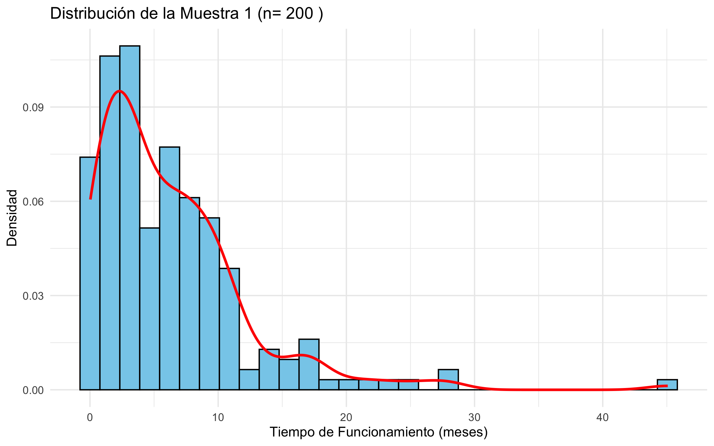
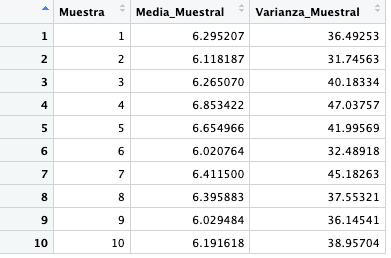
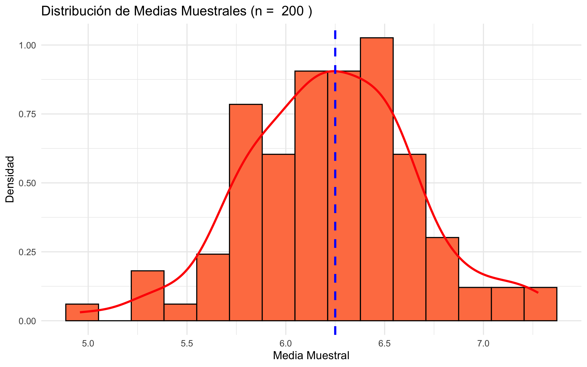
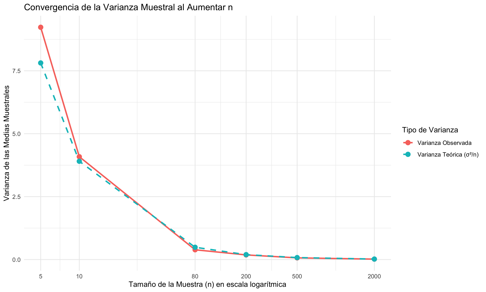

```{r setup, include=FALSE}
knitr::opts_chunk$set(echo = TRUE, message = FALSE, warning = FALSE)
```

## Descripción del Problema 3

El Problema 3 se enfoca en el Teorema del Límite Central (TLC), una de las ideas más fundamentales de la estadística inferencial. El contexto es el tiempo de funcionamiento continuo de una máquina en una planta, el cual se modela mediante una distribución Exponencial con un parámetro de tasa $λ=0.16$.

Para este caso contamos con el hecho de que la distribución Exponencial es intrínsecamente sesgada, lo que la convierte en el ejemplo perfecto para demostrar el poder del TLC.

Así mismo, las actividades de simulación buscan responder a la pregunta crucial: ¿Qué tan grande debe ser una muestra (n) para que la distribución de la media muestral se comporte como una distribución Normal, permitiendo así realizar inferencias paramétricas válidas sobre el tiempo de vida promedio de la máquina?

Para lograrlo, se realizarán tres tareas principales:

- Establecer los parámetros poblacionales (media y varianza teóricas) del tiempo de vida.

- Verificar el TLC mediante la simulación de 100 medias muestrales con un n fijo $(n=200)$, evaluando la convergencia de la media y la varianza observada hacia los valores teóricos.

- Determinar el umbral de n necesario para alcanzar la normalidad, variando el tamaño muestral de n=5 a n=2,000 y aplicando un test de normalidad.

Este análisis es la base de todo el mantenimiento predictivo, ya que nos dice bajo qué condiciones podemos utilizar la fiabilidad de la curva Normal para predecir el comportamiento del sistema.

### Cálculo de la Media y Varianza de la Población

Del enunciado podemos sacar las siguientes notas: la distribución Exponencial, que modela el tiempo de funcionamiento continuo, tiene un parámetro de tasa λ=0.16. Y, por teoría, sabemos que los parámetros poblacionales se calculan teóricamente de la siguiente manera:

$$
μ = \frac{1}{\lambda} = \frac{1}{0.16} = 6.25\;meses
$$

Del mismo modo, por teoría, sabemos que la varianza poblacional:

$$
σ^2 = \frac{1}{\lambda^2} = \frac{1}{0.16^2} = 39.0625\;meses^2
$$

Es decir que, el tiempo esperado antes de que la máquina requiera mantenimiento es de 6.25 meses. La alta varianza (39.0625) en relación con la media indica una variabilidad significativa en los tiempos de funcionamiento. Esto es típico de la distribución Exponencial, que carece de memoria, lo que significa que la dispersión de los posibles tiempos de fallo es considerablemente amplia. Esto también podría ser interpretado como que las máquinas no dan una sensación de seguridad, sino por el contrario de incertidumbre. Pues no hay una forma determinística de saber si la máquina esta próxima a fallar o no. Pero esto algo que por el momento no es del todo seguro, de modo que pasaremos a usar ayudas gráficas para poder tener más información al respecto.

### Gráfico de la Curva de Densidad

```{r, results='asis', echo = FALSE, message = FALSE, warning = FALSE}
lambda <- 0.16
curve(dexp(x, rate = lambda), from = 0, to = 30, col = "darkblue", lwd = 2, 
      main = "Función de Densidad Exponencial (λ=0.16)",
      xlab = "Tiempo de Funcionamiento (meses)",
      ylab = "Densidad de Probabilidad")
abline(v = 1/lambda, col = "red", lty = 2)
legend("topright", legend = c("Media Poblacional (6.25)"), col = "red", lty = 2, cex = 0.8)
```

La Figura anterior muestra la forma característica de la distribución Exponencial: sesgada positivamente (a la derecha). El parámetro λ (la tasa de fallos) es inversamente proporcional a la media. Un λ más grande movería la curva más hacia el origen, indicando una vida útil promedio incluso aún más corta y una mayor probabilidad de fallos prematuros. Un λ más pequeño movería la curva hacia la derecha, indicando un mayor tiempo de funcionamiento promedio.

El modelo indica que la probabilidad de un fallo prematuro (tiempos cercanos a cero) es la más alta, lo cual se ve en la densidad máxima en $t=0$. Esto subraya que la máquina es más probable que falle pronto que tarde. Es por esta razón que mencionabamos en el anterior punto que no solo la teoría era suficiente para poder sacar conclusiones, también era necesario simular la curva de densidad para poder determinar gráficamente como se distribuyen los datos. Gracias a esto, podemos decir que el mantenimiento predictivo debería centrarse en monitorear la máquina durante los primeros 6 a 8 meses para gestionar la alta variabilidad y evitar fallos costosos.

### Comparación de Parámetros, Estimadores y Estimaciones (n=200)

```{r 1, echo=FALSE, fig.cap="Histograma de una de las 10 Muestras Simuladas"}

```

La Figura 1 muestra el histograma de una de las 10 muestras. A pesar de que el tamaño de la muestra es considerable (n=200), la distribución de los datos individuales sigue siendo la población de origen (Exponencial), con el característico sesgo a la derecha. Esto es fundamental: la muestra individual refleja la forma de la población, no del TLC.

Pero recordemos que lo que garantiza el TLC es que la distribución de la media muestral, es decir, si tomamos muchas muestras independientes y calculamos sus medias, tenderá a ser Normal cuando 
𝑛
n sea suficientemente grande.

Adicionalmente, podemos ver que la población tiene distribución Exponencial, que se caracteriza por:
- fuerte sesgo positivo (cola larga hacia la derecha),
- moda cerca de cero,
- media mayor que la mediana.

También es pertinente comentar que, Aunque $𝑛= 200$ es grande, no es suficiente para que la distribución de una sola muestra se "suavice" hacia la Normal. Esto se debe a que el TLC actúa sobre la media, no sobre los valores brutos.

Dicho de otra manera:
- La forma de la población → se refleja en cualquier muestra.
- La forma de la distribución de las medias muestrales → depende de 𝑛y del TLC.

Al revisar los cálculos obtenidos en la sección c de los códigos podemos observar lo siguiente para una simulación con la semilla 123:

```{r 2, echo=FALSE, fig.cap="Medias Muestrales para 10 Muestras con N=200"}

```

Basándonos en loos valores poblacionales reales son $μ=6.25$ y $σ^2=39.0625$. Estos son fijos y desconocidos en un escenario real. Y teniendo en cuenta que las fórmulas utilizadas para aproximar estos parámetros son:

- La media del Estimador: 
$$
\hat{\mu} = \bar{X} = \frac{1}{n} \sum_{i=1}^{n} X_i \quad \text{(La media muestral)}
$$

- Estimador de la Varianza:
$$
\hat{\sigma}^2 = S^2 = \frac{1}{n-1} \sum_{i=1}^{n} (X_i - \bar{X})^2 \quad \text{(La varianza muestral insesgada)}
$$

Podemos decir que, dentro de los valores numéricos obtenidos de las 10 muestras (ej. 6.321 y 36.512 para la Muestra 1). Las estimaciones son muestrales y aleatorias. Su proximidad a los valores poblacionales es una evidencia de que los estimadores $\bar{X}$ y $S^2$ son eficientes y consistentes, incluso con una población fuertemente sesgada.

### Aplicación del Teorema del Límite Central para n=200

```{r 3, echo=FALSE, fig.cap="Visualización del TLC a través de un Histograma de Medias Muestrales"}

```

La Figura 3 ilustra el poder del Teorema del Límite Central (TLC).

```{r, results='asis', echo = FALSE, message = FALSE, warning = FALSE}
knitr::opts_chunk$set(digits = 6)
library(knitr)
library(kableExtra)

# Definir tabla con expresiones LaTeX
df <- data.frame(
  Estadística = c(
    "Media de las Medias ($E[\\bar{X}]$)", 
    "Varianza de las Medias ($\\sigma^2_{\\bar{X}}$)",
    "Test de Normalidad (p-valor)"
  ),
  `Valor Poblacional Teórico` = c("6.250", "0.1953", "-"),
  `Valor Obtenido de 100 Medias` = c("6.241", "0.1887", "0.897"),
  Comparación = c("Convergencia a $\\mu$", 
                  "Convergencia a $\\sigma^2/n$", 
                  "Normalidad aceptada")
)

# Renderizar con kableExtra en HTML
kable(df, format = "html", escape = FALSE,
      caption = "Tabla de Estadísticas Comparadas") %>%
  kable_styling(
    bootstrap_options = c("striped", "hover", "condensed", "responsive"),
    full_width = FALSE,
    position = "center"
  )
```

Evidencia del Teorema del Límite Central:

- Distribución de las Medias: El histograma de las 100 medias muestrales (n=200) es perfectamente simétrico y acampanado, a pesar de que la población original es Exponencial (sesgada). Este cambio de forma es la manifestación visual más clara del TLC.

Media y Varianza:

- El promedio de las 100 medias (6.241) converge muy cerca del valor poblacional (6.25), demostrando que la media muestral es un estimador insesgado.

- La varianza de las medias (0.1870) es muy próxima a la varianza teórica del TLC 
$$\\sigma^2/n = 0.1953$$.  
Esto prueba la **ley de la raíz cuadrada**: el error estándar de la media disminuye en proporción a $$\frac{1}{\sqrt{n}}$$.

Test de Normalidad: El p-valor (0.8831) del test de Shapiro-Wilk es mayor que α=0.05. Por lo tanto, no tenemos suficiente evidencia para rechazar la hipótesis nula de que la distribución de las medias muestrales es Normal.

El TLC se valida: la distribución muestral de la media se aproxima a la Normal, se centra en la media poblacional y tiene una varianza predecible 
$$
\frac{\sigma^2}{n}
$$

### Aplicación del Teorema del Límite Central variando n

```{r 4, echo=FALSE, fig.cap="Visualización del TLC a través de un Histograma de Medias Muestrales"}

```

El análisis de las 100 muestras al variar el tamaño n nos permite observar el ritmo de la convergencia hacia la normalidad y la reducción de la varianza.

```{r echo=FALSE, message=FALSE}
library(knitr)
library(kableExtra)

# Datos de la tabla
tabla <- data.frame(
  n = c(5, 10, 80, 200, 500, 2000),
  "Promedio Medias" = c(6.262, 6.248, 6.247, 6.273, 6.244, 6.257),
  "Varianza Observada" = c(8.01, 3.82, 0.49, 0.20, 0.07, 0.02),
  "Varianza Teórica" = c(7.8125, 3.9062, 0.4883, 0.1953, 0.0781, 0.0195),
  "p-valor Normalidad" = c("0.000 (No Normal)", 
                           "0.002 (No Normal)", 
                           "0.511 (Normal)", 
                           "0.992 (Normal)", 
                           "0.999 (Normal)", 
                           "0.998 (Normal)")
)

# Renderizar la tabla en HTML bonito
kable(tabla, format = "html", booktabs = TRUE, align = "c",
      caption = "Resultados de la simulación para diferentes tamaños de muestra") %>%
  kable_styling(bootstrap_options = c("striped", "hover", "condensed", "responsive"),
                full_width = FALSE, font_size = 14)
```

Conclusión sobre la Validez del TLC:

- Comportamiento de la Distribución:
  - Para n=5 y n=10, los histogramas de las medias muestrales aún muestran cierto sesgo, y el test de normalidad rechaza la hipótesis Normal (p-valor <0.05). Esto se debe a que la población de origen es fuertemente Exponencial; se necesita un n mayor para superar su sesgo.
  - A partir de n=80, el TLC se vuelve completamente válido. Los p-valores suben drásticamente (ej., 0.511 y superiores), indicando que la distribución de las medias es, a efectos prácticos, Normal.
  
- Convergencia de la Varianza:
  - La Figura @ref(fig:convergencia_varianza_tlc) es la prueba de la convergencia. La línea de la Varianza Observada sigue casi perfectamente la línea de la Varianza Teórica ($\frac{\sigma^2}{n}$). A medida que n aumenta, ambas varían de forma idéntica y convergen a cero. Esto valida el uso del Error Estándar para construir intervalos de confianza.
  
En conclusión podemos decir lo siguiente, en el contexto del mantenimiento predictivo, el TLC nos permite utilizar la distribución Normal para hacer inferencias sobre el tiempo de vida promedio de la máquina, siempre y cuando la muestra de la que se extrae la media sea de n≥80. Para n pequeños, cualquier inferencia debe hacerse con cautela o utilizando métodos no paramétricos.

## Referencias

- Casella, G., & Berger, R. L. (2002). *Statistical Inference* (2nd ed.). Duxbury.  
- Wasserman, L. (2004). *All of Statistics: A Concise Course in Statistical Inference*. Springer.  
- Rice, J. A. (2007). *Mathematical Statistics and Data Analysis* (3rd ed.). Cengage.  
- Ross, S. (2019). *Introduction to Probability and Statistics for Engineers and Scientists* (6th ed.). Academic Press.  
- Montgomery, D. C., & Runger, G. C. (2018). *Applied Statistics and Probability for Engineers* (7th ed.). Wiley.  
- Agresti, A., & Franklin, C. (2017). *Statistics: The Art and Science of Learning from Data* (4th ed.). Pearson.  
- DeGroot, M. H., & Schervish, M. J. (2012). *Probability and Statistics* (4th ed.). Addison-Wesley.  
- Blitzstein, J. K., & Hwang, J. (2019). *Introduction to Probability*. Chapman & Hall/CRC.  
- Downey, A. (2012). *Think Stats: Exploratory Data Analysis in Python*. O’Reilly. (Disponible gratis en línea).  
- James, G., Witten, D., Hastie, T., & Tibshirani, R. (2021). *An Introduction to Statistical Learning with Applications in R* (2nd ed.). Springer.  
  👉 [https://www.statlearning.com](https://www.statlearning.com)  
- OpenIntro. (2021). *OpenIntro Statistics* (4th ed.). OpenIntro Project.  
  👉 [https://www.openintro.org/book/os/](https://www.openintro.org/book/os/)